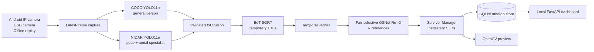

<div align="center">

# 🛩️ NIDAR AirMouse

### Survivor-Perception & Duplicate-Suppression ML Proof of Concept

**Android / USB Camera · Hybrid YOLO · BoT-SORT · Temporal Verification · OSNet Re-ID · SQLite · FastAPI**


> A laptop-based perception prototype that detects visible people/body candidates,
> tracks them through a moving camera, verifies detections over time, assigns
> persistent mission identities (`S1`, `S2`, `S3` …), and suppresses duplicate
> counts when a person returns.

[🚀 Quick start](#-quick-start) · [🧠 Architecture](#-system-architecture) ·
[📊 Results](#-validated-results) · [🎥 Demo modes](#-demo-modes) ·
[📚 Documentation](#-documentation-map)

</div>

---

## ✨ What makes this project different?

| Capability | What it does | Why it matters |
|---|---|---|
| 🟩 Hybrid person detector | Combines general COCO YOLO11n with a validated posture/aerial specialist | Improves lying, fallen, small and unusual-angle person coverage |
| 🧭 BoT-SORT tracking | Maintains temporary track continuity under camera motion | Prevents every frame from being treated as a new person |
| ⏳ Temporal verification | Requires repeated evidence before confirmation | A single weak frame cannot create a survivor record |
| 🧬 OSNet appearance Re-ID | Compares quality-gated appearance embeddings | Recognises a returning person across track changes |
| 🪪 Persistent S identities | Allocates `S1`, `S2`, `S3` … in SQLite | Gives each accepted mission identity an auditable record |
| ♻️ Duplicate suppression | Reuses an existing S identity on accepted return | Avoids inflating the mission-unique estimate |
| 📱 Multiple camera inputs | IP Webcam over 5 GHz, native USB webcam, local replay | Works with current demo hardware and supports migration |
| 🖥️ Operator dashboard | Local read-only FastAPI interface with metrics and reports | Gives the operator visibility without controlling flight-critical logic |

> [!IMPORTANT]
> `person_candidate` means visible human/body evidence. The software does **not**
> infer death, injury, consciousness, health, or medical survivor status.

## 🧠 System architecture



### Identity vocabulary

| Label | Lifetime | Meaning |
|---|---|---|
| `P1`, `P2`… | One replay image | Current-frame detection label only |
| `E1:T7` | One tracker epoch | Temporary BoT-SORT track |
| `R1`, `R2`… | One appearance gallery | Internal Re-ID reference |
| `S1`, `S2`, `S3`… | One mission database | Persistent appearance-based identity estimate |

The system is **not limited to S1/S2**. The integrated regression creates and
persists `S1–S8`, then recovers all eight people after their tracker IDs change.
The reviewed gallery capacity is 64 mission identities; YOLO allows up to 100
detections per frame.

## 📊 Validated results

### Hybrid detector — unchanged 2,956-image held-out test

| Metric | COCO baseline | NIDAR hybrid |
|---|---:|---:|
| COCO recall | 71.86% | **72.14%** |
| COCO precision | **81.92%** | 77.71% |
| Fallen-person recall | 60.89% | **92.22%** |
| Lying recall | 40.91% | **93.18%** |
| Sitting recall | — | **93.75%** |
| Standing recall | — | **100.00%** |
| Aerial/VisDrone recall | 4.42% | **12.17%** |
| Small-person recall | 6.78% | **23.71%** |
| Large-person recall | 80.29% | **92.20%** |

- ✅ Strict detector promotion checks: **10 / 10 passed**
- ✅ Complete automated suite: **193 tests + 36 subtests passed**
- ✅ Phone-free real-YOLO scene counts: **1, 2, 4, 6, 4, 6**
- ✅ All 42 simulated motion variants preserve their expected counts
- ✅ Eight-person S-ID regression: `S1–S8`, SQLite integrity `ok`, no return inflation

These are public-data and controlled engineering results—not field certification.
See [the hybrid detector report](ML/docs/phase_reports/HYBRID_PERSON_DETECTOR_PROMOTION.md)
and [multi-person identity report](ML/docs/phase_reports/MULTI_PERSON_IDENTITY_SCALING.md).

## 🚀 Quick start

### Prerequisites

- Windows 10/11 x64
- Python **3.11 x64** available through the Windows `py` launcher
- NVIDIA GeForce RTX 3050-class CUDA GPU for the validated setup
- 24 GB system RAM recommended
- Internet once for Python packages and six checksum-pinned demo images

### 1. Clone and enter the ML project

```powershell
git clone https://github.com/RajGoyal01/NIDAR.git
cd '.\NIDAR\Raj Gupta\ML'
```

### 2. Run the one-command setup

```powershell
Set-ExecutionPolicy -Scope Process Bypass
.\Setup-NIDAR.ps1
```

The setup script:

1. creates an isolated `.venv` with Python 3.11;
2. installs pinned CUDA, ML, API and test dependencies;
3. verifies all bundled model files using size + SHA-256;
4. downloads only six licence-recorded, checksum-pinned showcase images;
5. validates Python, packages, CUDA, OpenCV and local video I/O.

For the complete automated suite:

```powershell
.\Setup-NIDAR.ps1 -RunTests
```

## 🎥 Demo modes

### A. Phone-free professor demo

```powershell
.\Start-OfflineDemo.ps1
```

Controls: `N`/Right next · `P`/Left previous · `R` re-detect · `Space` pause · `Q`/Esc quit.

### B. Android IP Webcam over 5 GHz

1. Start **IP Webcam** on the Android phone.
2. Connect laptop and phone through the same 5 GHz network/hotspot.
3. Use the base address displayed by the app:

```powershell
.\Start-PhoneDemo.ps1 -PhoneUrl http://PHONE_IP:8080 -Manage
```

Add `-Dashboard` only when the local web dashboard is wanted. The native OpenCV
preview remains the clearest low-overhead demonstration.

### C. USB / Windows camera

```powershell
.\Start-USBCameraDemo.ps1 -ListCameras
.\Start-USBCameraDemo.ps1 -CameraIndex 0 -Mode Full
```

### D. Detection-only or tracking-only

```powershell
.\Start-USBCameraDemo.ps1 -CameraIndex 0 -Mode Detect
.\Start-USBCameraDemo.ps1 -CameraIndex 0 -Mode Track
```

### E. COCO-only fallback/comparison

```powershell
.\Start-OfflineDemo.ps1 -BaselineDetector
```

## 🧩 ML stack

| Layer | Technology | Responsibility |
|---|---|---|
| Capture | OpenCV + bounded latest-frame reader | Prevent stale-frame queues and recover streams |
| Detection | Ultralytics YOLO11n × 2 | General + posture/aerial person evidence |
| Fusion | Typed Python policy | Confidence/shape/size qualification and IoU de-duplication |
| Tracking | BoT-SORT + sparse optical-flow GMC | Temporary identity continuity |
| Verification | Rolling 3-of-5 temporal evidence | Reject one-frame detections |
| Re-ID | OSNet x0.25 MSMT17 | Appearance-based return matching |
| Persistence | SQLite WAL + atomic transactions | Mission identities, events, counters and gallery |
| API/UI | FastAPI + vanilla HTML/CSS/JS | Local, read-only operational dashboard |
| Compute | PyTorch CUDA FP16 | Laptop inference on RTX 3050 |

## 📁 Repository layout

```text
Raj Gupta/
├── README.md                         # This project overview
└── ML/
    ├── nidar_survivor_demo/          # Detection, tracking, Re-ID, manager, API
    │   ├── camera/                    # MJPEG/snapshot/latest-frame capture
    │   ├── settings/                  # Reviewed JSON configuration
    │   ├── tests/                     # Automated regression suite
    │   ├── vendor/                    # Pinned OSNet architecture + licence
    │   └── web/                       # Local dashboard frontend
    ├── models/                        # Three checksum-pinned runtime weights
    ├── docs/                          # Phase reports, metrics and setup guides
    ├── .vscode/                       # Tasks, launch profiles and settings
    ├── Setup-NIDAR.ps1                # One-command environment setup
    ├── Start-OfflineDemo.ps1          # Phone-free real-YOLO presentation
    ├── Start-PhoneDemo.ps1            # 5 GHz Android stream
    ├── Start-USBCameraDemo.ps1        # Native camera alternative
    └── Start-Dashboard.ps1            # Local dashboard launcher
```

## 🧪 Testing

```powershell
.\.venv\Scripts\python.exe -m pytest -q
.\.venv\Scripts\python.exe -m pip check
.\Start-OfflineDemo.ps1 -Headless -Cycles 1
```

Important targeted regression:

```powershell
.\.venv\Scripts\python.exe -m pytest `
  nidar_survivor_demo\tests\test_multi_identity_scaling.py -q
```

## 🗃️ Datasets and reproducibility

Raw datasets, virtual environments, generated missions, training runs and logs are
intentionally excluded from Git. They are large/generated artifacts, not source.
The repository retains all acquisition, conversion, leakage-safe splitting,
training, evaluation, gate and recovery scripts required to reproduce them.

| Dataset | Project use |
|---|---|
| COCO 2017 | General person positives and hard negatives |
| Fallen Person v2 | Lying, fallen, sitting and standing body candidates |
| VisDrone2019-DET | Aerial, small and crowded people |

Dataset licensing and provenance must be checked before redistribution or external
deployment. No class is interpreted as medical or life status.

## 🔐 Safety and privacy

- Camera frames are processed locally; raw frames are not written by default.
- Dashboard routes are read-only and local-only.
- Secrets, camera credentials and machine-specific addresses are not committed.
- SQLite saves identity decisions atomically before counters advance.
- Perception failure never issues flight-control commands.
- Pixhawk-class hardware remains responsible for flight-critical safety.

## 🛣️ Prototype → final drone

| Laptop prototype | Final NIDAR direction |
|---|---|
| Android/USB RGB camera | OAK-D Lite RGB + stereo depth + IMU |
| Laptop RTX 3050 | OAK accelerator and/or Raspberry Pi companion |
| Screen-space position | Camera-to-map 3D/2D position |
| Appearance duplicate suppression | Appearance + depth + SLAM spatial fusion |
| Handheld camera motion | Pixhawk-controlled autonomous flight |
| Local dashboard | Ground Control Station live map + markers + health |

## 📚 Documentation map

- [Project context](ML/PROJECT_CONTEXT.md)
- [ML architecture](ML/ML_ARCHITECTURE.md)
- [Demo and phase plan](ML/ML_DEMO_PLAN.md)
- [Final data-collection plan](ML/docs/NIDAR_FINAL_DATA_COLLECTION.md)
- [Hybrid detector promotion](ML/docs/phase_reports/HYBRID_PERSON_DETECTOR_PROMOTION.md)
- [Multi-person S-ID scaling](ML/docs/phase_reports/MULTI_PERSON_IDENTITY_SCALING.md)
- [Phone stream](ML/docs/phase_reports/PHASE_01_PHONE_STREAM.md)
- [Person detection](ML/docs/phase_reports/PHASE_02_PERSON_DETECTION.md)
- [BoT-SORT tracking](ML/docs/phase_reports/PHASE_03_BOTSORT_TRACKING.md)
- [Temporal verification](ML/docs/phase_reports/PHASE_04_TEMPORAL_VERIFICATION.md)
- [Appearance Re-ID](ML/docs/phase_reports/PHASE_05_APPEARANCE_REID.md)
- [Persistent survivor manager](ML/docs/phase_reports/PHASE_06_SURVIVOR_MANAGER.md)
- [Dashboard](ML/docs/phase_reports/PHASE_07_DASHBOARD.md)
- [Performance optimisation](ML/docs/phase_reports/PHASE_08_PERFORMANCE.md)
- [VS Code setup](ML/docs/VSCODE_DEMO_SETUP.md)

---

<div align="center">

### NIDAR AirMouse

**Measure honestly · fail safely · preserve uncertainty · improve with evidence**

Made for a controlled survivor-perception proof of concept—not presented as a
finished autonomous rescue drone.

</div>
